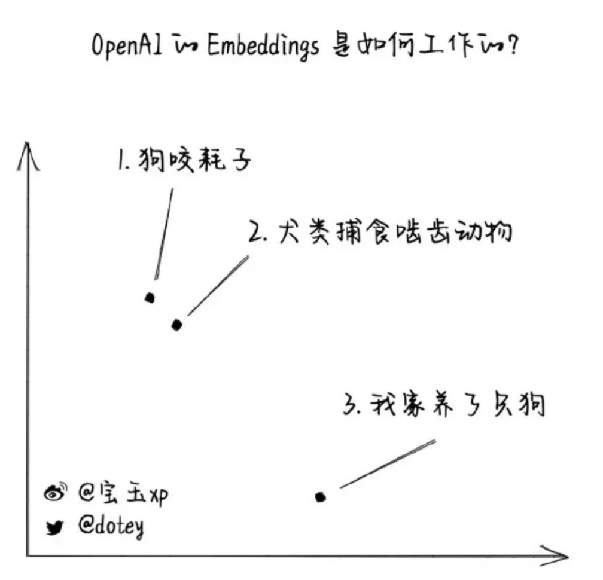

# 🎢 Eembeddings 嵌入

在自然语言处理和机器学习领域，"embeddings" 是指将单词、短语或文本转换成连续向量空间的过程。这个向量空间通常被称为嵌入空间（embedding space），而生成的向量则称为嵌入向量（embedding vector）或向量嵌入（vector embedding）。

嵌入向量可以捕获单词、短语或文本的语义信息，使得它们可以在数学上进行比较和计算。这种比较和计算在自然语言处理和机器学习中经常被用于各种任务，例如文本分类、语义搜索、词语相似性计算等。

在中文语境下，"embeddings" 通常被翻译为 "词向量" 或者 "向量表示"。这些翻译强调了嵌入向量的特点，即将词汇转换成向量，并表示为嵌入空间中的点。embedding 其实来源于 word2vec 技术。比如我们将下面三句话进行向量化：
1. "狗咬耗子"
2. "犬类捕食啮齿动物"
3. "我家养了只狗"

